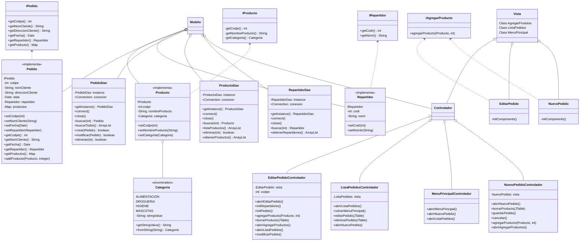
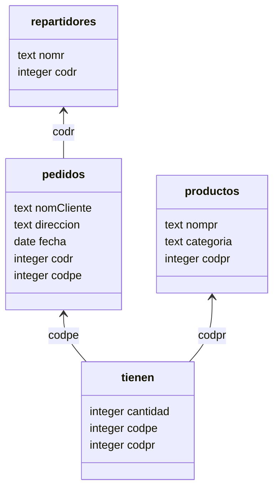
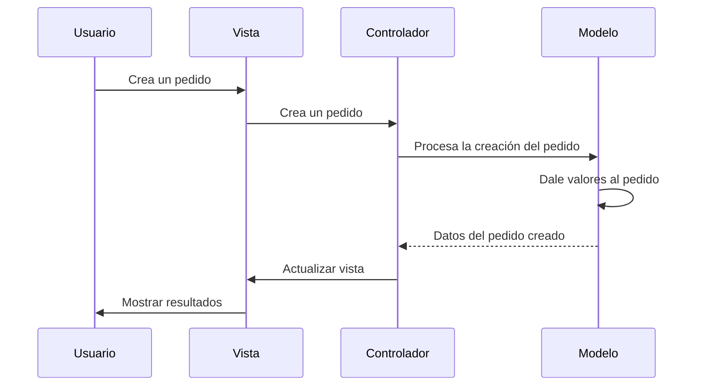
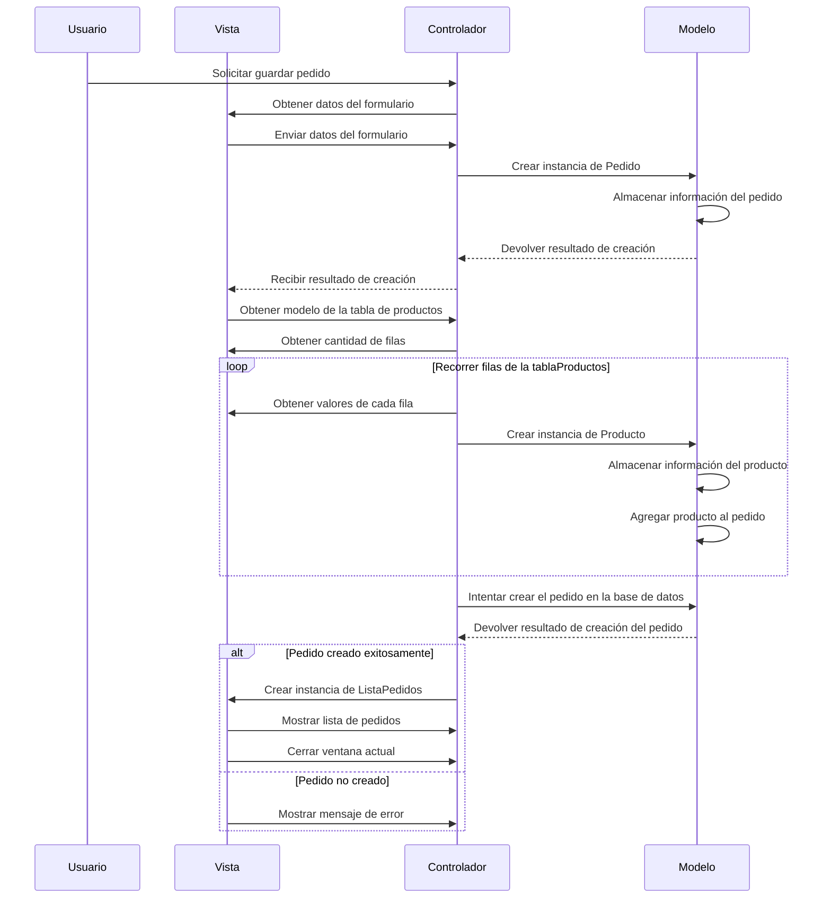

# Descripción de la aplicación
El proyecto **Shopper** consiste en el desarrollo de una aplicación de **gestión de pedidos** para una ***tienda online***,
que permitirá a los usuarios realizar y administrar pedidos de manera eficiente.<br>
La aplicación también llevará un registro detallado de los **productos disponibles**, así como de los **repartidores**
asociados a cada pedido, brindando así un control completo sobre todo el proceso de entrega.<br>
Con **Shopper**, los clientes podrán disfrutar de una experiencia de compra cómoda y fluida, mientras que los ***administradores 
de la tienda*** podrán gestionar de manera eficaz todos los aspectos relacionados con los pedidos y la logística.

## DIAGRAMA DE CLASES


## DIAGRAMA DE CLASES SIMPLIFICADO


## ENTIDAD RELACIÓN DE LA BASE DE DATOS


## PATRON MVC (MODELO-VISTA-CONTROLADOR)


## DIAGRAMA DE SECUENCIA
Dado que el proyecto implica el desarrollo de una aplicación de **gestión de pedidos**, 
es apropiado representar el **diagrama de secuencias** que describe la interacción de la aplicación en general.<br> 
Para lograr esto, se aplica el **Patrón de Diseño MVC (Modelo-Vista-Controlador)**, 
que ayuda a organizar y separar las responsabilidades de la aplicación de manera eficiente.

## DIAGRAMA DE SECUENCIA DEL METODO GUARDAR PEDIDO
```ruby
public void guardarPedido() {
        Pedido pedido = new Pedido();
        pedido.setNomCliente(vista.gettNombreCliente().getText());
        pedido.setDireccionCliente(vista.gettDireccionCliente().getText());
        pedido.setFecha(Date.valueOf(vista.gettFechaPedido().getText()));
        String selectedItem = (String) vista.getBoxRepartidores().getSelectedItem();
        String[] parts = selectedItem.split(" - ");
        int codr = Integer.parseInt(parts[0]);
        Repartidor repartidor = RepartidorDao.getInstance().buscar(codr);
        pedido.setRepartidor(repartidor);
        DefaultTableModel model = (DefaultTableModel) vista.getTablaProductos().getModel();
        int cantidadDeFilas = model.getRowCount();
        for (int fila = 0; fila < cantidadDeFilas; fila++) {
            int codpr = (Integer) (model.getValueAt(fila, 0));
            int cantidad = (Integer) (model.getValueAt(fila, 3));
            Producto producto = new Producto();
            producto.setCodpr(codpr);
            pedido.addProducto(producto, cantidad);
        }
        if (PedidoDao.getInstance().crear(pedido)) {
            ListaPedidosControlador pedidos = new ListaPedidosControlador();
            pedidos.abrirListaPedidos();
            vista.dispose();
        }
    }
```
En este flujo de eventos representado en el diagrama, el **usuario** (U) realiza una solicitud al **controlador** (C) para guardar un pedido. 
El controlador se encarga de recopilar los datos ingresados en el formulario desde la **vista** (V) y crea una instancia del **Modelo de Pedido** (M). 
A continuación, el controlador recorre las filas de la tabla de productos, creando instancias de **Producto** en el modelo en base a los datos proporcionados.

Una vez completada la recopilación de información, el controlador intenta crear el pedido en la **base de datos** utilizando el modelo. 
Si el proceso de creación es exitoso, se crea una instancia de **ListaPedidos** y se muestra en la vista, brindando al usuario una visualización actualizada 
de los pedidos. Sin embargo, si la creación del pedido no tiene éxito, se muestra un mensaje de error en la vista para informar al usuario sobre el problema encontrado.

Este flujo de acciones ilustra cómo el controlador actúa como intermediario entre el usuario, la vista y el modelo, garantizando la coordinación adecuada 
entre ellos en el contexto del patrón de diseño **MVC (Modelo-Vista-Controlador)**.

## MENÚ PRINCIPAL


## NUEVO PEDIDO


## AGREGAR PRODUCTOS


## LISTA DE PEDIDOS


## EDITAR PEDIDO


