# Descripción de la aplicación
El proyecto Shopper consiste en el desarrollo de una aplicación de gestión de pedidos para una tienda online,
que permitirá a los usuarios realizar y administrar pedidos de manera eficiente. 
La aplicación también llevará un registro detallado de los productos disponibles, así como de los repartidores
asociados a cada pedido, brindando así un control completo sobre todo el proceso de entrega. 
Con Shopper, los clientes podrán disfrutar de una experiencia de compra cómoda y fluida, mientras que los administradores 
de la tienda podrán gestionar de manera eficaz todos los aspectos relacionados con los pedidos y la logística.

## DIAGRAMA DE CLASES

```mermaid
classDiagram
    class Modelo {
    }

    class Vista {
    }

    class Controlador {
    }

    class PedidoDao {
    -PedidoDao: instance
    +Connection: conexion
    +getInstance()PedidoDao
    +connect()
    +close()
    +buscar(int)Pedido
    +buscarTodos()ArrayList
    +crear(Pedido)boolean
    +modificar(Pedido)boolean
    +eliminar(int)boolean
    }

    class ProductoDao {
    -ProductoDao: instance
    +Connection: conexion
    +getInstance()ProductoDao
    +connect()
    +close()
    +buscar(int)Producto
    +listaProductos()ArrayList
    +eliminar(int)boolean
    +obtenerProductos()ArrayList
    }

    class RepartidorDao {
    -RepartidorDao: instance
    +Connection: conexion
    +getInstance()RepartidorDao
    +connect()
    +close()
    +buscar(int)Repartidor
    +obtenerRepartidores()ArrayList        
    }

    class Categoria {
    <<enumeration>>
    ALIMENTACION
    DROGUERIA
    HIGIENE
    MASCOTAS
    -String: stringValue
    +getStringValue()String
    +fromString(String)Categoria
    }

    class IPedido {
    +getCodpe()int
    +getNomCliente()String
    +getDireccionCliente()String
    +getFecha()Date
    +getRepartidor()Repartidor
    +getProducto()Map   
    }

    class Pedido {
        <<implementa>>
        IPedido
     -int: codpe
     -String: nomCliente
     -String: direccionCliente
     -Date: data
     -Repartidor: repartidor
     -Map: productos
     +setCodpe(int)
     +setNomCliente(String)
     +setFecha(Date)
     +setRepartidor(Repartidor)
     +getCodpe()int
     +getNomCliente()String
     +getFecha()Date
     +getRepartidor()Repartidor
     +getProductos()Map
     +addProducto(Producto, Integer)
    }

    class IAgregarProducto {
      +agregarProducto(Producto, int)
    }

    class IProducto {
    -getCodpr()int
    -getNombreProducto()String
    -getCategoria()Categoria
    }

    class Producto {
        <<implementa>>
        IProducto
     -int:codpr
     -String: nombreProducto
     -Categoria: categoria   
     +setCodpr(int)
     +setNombreProducto(String)
     +setCategoria(Categoria)
 
    }

    class IRepartidor {
    +getCodr()int
    +getNomr()String
    }

    class Repartidor {
        <<implementa>>
        IRepartidor
     -int: codr
     -String: nomr
     +setCodr(int)
     +setNombr(String)
    }

    class AgregarProductos {
    -IAgregarProducto: agregarProducto
    -initProductos()
    -initComponents() 
    }

    class EditarPedido {
     <<implementa>>
    IAgregarProducto
    }

    class ListaPedidos {
    -initTabla()
    -initComponents()
    }

    class MenuPrincipal {
    -initComponents()
    }

    class NuevoPedido {
     <<implementa>>
    IAgregarProducto
   -initRepartidores()
   -initComponents()
    }

   
    Producto o-- Categoria
    
    Modelo o-- Producto
    Modelo o-- Pedido    
    Modelo o-- Repartidor

    Modelo o-- PedidoDao
    Modelo o-- ProductoDao
    Modelo o-- RepartidorDao

    Modelo <|-- Controlador
    Vista <|-- Controlador

    Vista o-- AgregarProductos
    Vista o-- EditarPedido
    Vista o-- ListaPedidos
    Vista o-- MenuPrincipal
    Vista o-- NuevoPedido
    
    IRepartidor <.. Repartidor
    IPedido <.. Pedido
    IProducto <.. Producto
   
    IAgregarProducto <.. EditarPedido
    IAgregarProducto <.. NuevoPedido


```

